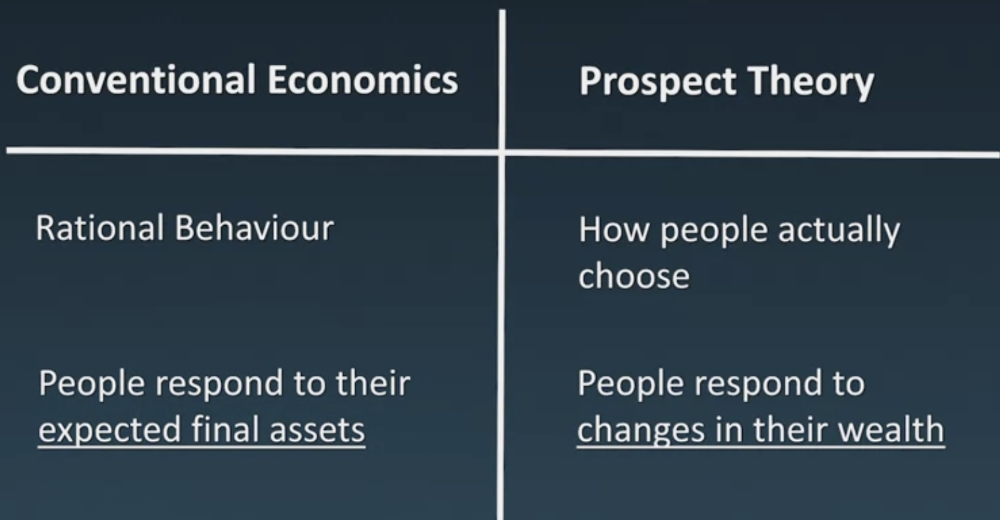

```{r setup, include=FALSE}
knitr::opts_chunk$set(echo = TRUE)
```

# Perface
Payment reform is the tool we use to improve health outcomes.

In this course on Alternative Payment Models (APMs)  you will learn about the rationale for payment reforms and dive into the key design elements of the most prominent APMs (P4P, shared savings, bundled payments and global payments). You will learn how these APMs theoretically change provider incentives. You will learn about a roadmap to design and implement APMs on your own. You will . After the course you can apply your sharpened skills to lead change in health care via innovative payment models in order to increase value of health care services.

During this course, we will address the following topics. 

+ Why alternative payment models? [Why do we need payment reforms in the first place?]
+ What is an alternative payment model? 
  + Here, we will dive into the key design elements of the various APMs (P4P, shared savings, bundled payments and global payments) and discuss how the change provide incentives. 
+ How to implement alternative payment model? [After that, we will also discuss how to design and implement these APMs by giving you a roadmap.] 
+ The role of behavioural economics within APMs. [learn about behavioural economics and human behaviour which are essential to advance the design and implementation of APMs ] This is crucial for us to understand provider's behavior.

This course focuses on how our providers are paid by the payers, a government or an issuer. So the relationship between payers and providers. In economic terms, this is called the **healthcare purchasing market**. However, within healthcare, we have three main actors namely; the **provider**, **payer**, and **patient or consumer**. We can conceptualize this as follows. This triangle shows you the three main actors in the **healthcare market**, which result in three inter-related markets. 

On the health insurance market, the triangle left side, depending on the healthcare system, consumers choose an insurance policy or pay tax to the government. 

On the health delivery markets, patient are treated by providers in order to meet their healthcare needs. 

To recap. Within this course we focus on provider pay contract which take place on the healthcare purchasing market. 

```{r , echo=FALSE, fig.cap="Healthcare purchasing market",  out.width='90%',fig.align='center'}
knitr::include_graphics("Healthcare_purchasing_market.png")
```


At the end of the course, I am able to start designing and implementing APMs yourself.

This course will become part of the to-be-developed  Leiden University master program Population Health Management. If you wish to find out more about this program see the course [Fundamentals of Population Health Management](https://www.coursera.org/learn/fundamentals-population-health-management)

```{r , echo=FALSE, fig.cap="Topics covered by this certificate",  out.width='90%',fig.align='center'}

```


# Module 1 Why Payment Reform?

## Why payment reform?

  + Current payment models are fragmented. Do not stimulate collaboration and are volume-based as most providers are paid via fee for service.
  + There is currently a misalignment between the overarching system goals, and the way we incentivize our providers. Instead of traditional fee for service models, we might need alternative payment models to introduce the right incentives.
  
## Overarching Goal: 

When design healthcare system, the policy maker is thinking about an overarching goal. An overarching goal, which is increasingly adopted in many countries is **patient value**.

```{r , echo=FALSE, fig.cap="Overarching Goal",  out.width='90%',fig.align='center'}

```

  + **Viewpoint 1**:
  
Porter explains that achieving high value for patients must become the overarching system goal of health care delivery. He defines value as the health outcomes achieved per dollar spent. 

[Porter (2010)](https://www.57357.org/app/uploads/2020/06/What-is-Value-in-Health-Care-NEJM-2010.pdf) define patient value as 

$Patient Value= \frac{Health Outcome}{Dollar  Spent}$

"Achieving high value for patients must become the overarching goal of health care delivery, with value defined as the health outcomes achieved per dollar spent." Porter (2010)

  + **Viewpoint 2**:
  
[Berwick et al (2008)](https://www.healthaffairs.org/doi/full/10.1377/hlthaff.27.3.759)

What are the 3 goals of a healthcare system?

1. Improving the patient experience of care (including quality and satisfaction); 
     
2. Improving the health of populations; 
     
3. Reducing the per capita cost of health care.

This world-famous article by Berwick and colleagues is considered as another philosophy which aim to define the overarching system goals by three intertwined goals (care, health and costs).

```{r , echo=FALSE, fig.cap="Berwick et al 2008",  out.width='90%',fig.align='center'}

```  
 
## Base Payment Models

1. Cost-based reimbursement
This model used to be applied in health care. Under this model, providers are reimbursed on the actual cost they have incurred. This means, that if you end up in the emergency room after a biking accident for instance, the hospital, doctor, and any supplies used will be reimbursed.

2. Fee-for-service
This payment model is by far the most dominant one in health care. Fee-for-service means that providers receive a reimbursement for each service providers according to a set price. The prices are set in advance during the negotiation that takes place between a payer and the provider. Although fee-for-service is mostly applied in health care, it has many conceptual design flows. Harold miller, another health economist, has written extensively about the limitation of the fee-for-service model. Let's discuss his perspective on the limitations. 
  + The first and most prominent limitation is that under the fee-for-service model, providers are paid for the amount of services they deliver and not on the quality of those services or the effectiveness. In other words, fee-for-service tends to seem like volume and not value, which is often not aligned with the overarching system goals. 
  + Secondly, each provider gets paid separately. This can result in paying for duplicated services for the same patient. 
  + Thirdly, it provide no incentives for providers to collaborating more with each other. 
  + Lastly, there are no incentive for preventive services. In the long run, this can result in unnecessary medical conditions and treatments.


Current fee for sevice system, overall poor quality, equity, and lack of accountability.

Frakt et al 2012
Unlike cost-based reimbursement, which establishes no prospective control over prices or volume, fee-for-service and DRG-based payment offer certainty of prices, which are set or negotiated prospectively.

3. Per dim payment
This means that a daily rate per patient is paid to a provider. This daily rate includes all services for that day which might include, services and medication, but also in-patient care. So if we go back to the biking example, and you are admitted to the hospital. The hospital receives a fixed fee for every day you will stay in hospital. What might be a consequence of this?

4. episode of care payment, also known as bundled payment. 
Bundled payment has received interests in recent years, and is increasingly launched and implemented in several countries. A bundled payment is a single payment that covers all the procedures, tests, drugs, and everything else needed for a patient medical condition. Bundles reward providers that deliver better health outcomes at lower costs. In our biking accident, this means that the services include the initial hospital stay, but also the services in the post-discharge period. Also, the cost of complications and re-admissions need to be paid out of the same bundled fee. These provide the incentives to avoid duplicated tests, complications, and re-admissions.

5. Capitation

Under capitation, provider receive a fixed amount per person, per month, quarter, or year. Providers are then responsible for patient's medical needs. Because provider revenues are independent of the volume, entitled treatment, capitation is presumed to motivate providers to be more efficient and invest in preventive care at lowest costs in the long run. Capitation, however, has its own limitations. The most prominent one is that there is a risk that a provider with stint of care. For instance, provider might deny access to expensive procedure and services. Also capitated provider can increase their margin and profits by targeting healthy populations and avoiding highly costly patients.

## Allocation of risk

```{r , echo=FALSE, fig.cap="Healthcare purchasing market",  out.width='90%',fig.align='center'}

```

The more we move from fee for service towards the right of the figure, providers assume you more accountability. For instance, when bundled payments are introduced, more accountability is shifted towards providers. Providers are now also at risk for duplicated services, readmissions and complications. This gives provider an incentive to improve quality of care, to collaborate better, and to avoid over and under-use.

Within the discussion of allocating risk, it is essential to understand that there are two types of risk. 

1. Performance risk 
2. Insurance risk. 

Performance risk is defined as risks that are related to the provider's own share in providing high-quality and efficient care, so the cost of care a provider can control. Insurance risk is defined as risk that stems from differences between the needs of patients. In other words, the cost of care that are outside the control of the providers. So we are in search of contracts that maximize the amount of performance risk, and at the same time minimize insurance risk. This will give providers the optimal incentive for creating value.


## Takeway of this module
One, payment reforms are not about paying care providers more or paying providers less, it's about paying care providers differently. By paying providers differently, we introduce incentive that may provide us extra willing to deliver patient value. 

Two, even though providers can be intrinsically motivated to do what's best for the patient, providers respond to payment reforms. 

Three, payment reforms aimed to shift financial accountability towards providers. 


# Module 2 What is APM?

APM Definition: An APM is every payment model that is not purely fee-for-service.

```{r , echo=FALSE, fig.cap="HCP-LAN",  out.width='90%',fig.align='center'}

```

## Type of APMs

### 1. Category 1: FFS not linked with value

The fee-for-service payment model within this category, rewards providers fully on the basis of volume without any linked value. So this category is actually not considered as an APM and can be seen as a traditional way of paying providers.

### 2. Category 2: Pay for performance P4P (FFS linked with value)

The second category includes payment models that still have a fee-for-service as base payment, but include a small additional payment or penalty. P4P  was the first APM which was widely applied in healthcare

This additional payment or penalty is related to a provider's ability to report on its performance. As we have learned in module 1, desired behavior can be encouraged by paying providers more, or discouraged by burying providers less for that particular behavior. Therefore, fee-for-service payments with an add-on payments may have a positive impact on the process of care delivery. 

These payments can be made in three ways. First, **infrastructure investment** that can improve the quality of patient care, for instance a diabetes registry. Next, **pay-for-reporting**, which means paying for reporting a quality metrics irrespectively of the outcomes, or third, **pay-for-outcome**, rewarding providers that perform well on quality metrics or penalize providers that do not perform well. We will discuss the pro and cons of pay-for-performance in the next lecture

----

Pay for performance is an add-on payment which is on top of a base payment model, often fee-for-service. P4P is a payment model that rewards healthcare providers for meeting pre-established targets for the delivery of healthcare service by financial incentives. So when you look at the figure, you see that the provider is reimbursed by the payer on a fee-for-service basis. When this provider reaches his upfront negotiated target, you get an additional financial reward. When the provider does not reaches target, he doesn't get any additional reward. By using the P4P incentive, payers aim to stimulate desired behavior providers. This differs from pure fee-for-service models because payment model is are only related to volume.

#### Key design elements of P4P model

Frank Iacona discusses in his dissertation the **key design elements of P4P models**.

+ **What to incentivise** The first key design element is the set of quality indicators used in the P4P model. In other words, what do we send incentivise? Quality by itself is a complex concept consisting of many different dimensions related to structures, processes, and outcomes as first described by Donabedian.

**Structure indicators** are defined as the characteristics of the settings in which occurs. This includes the attributes of material resources, for instance, IT applications or organizational structures like the amount of staff members.So for instance, a structure indicator could be the presence of an up-to-date registry for all diabetes patients. 

**Process indicators** assess what the provider did for the patient and how well it was done. A process indicator in the diabetes example could be the proportion of diabetes patients that had the blood sugar level tested regularly. 

**Outcome indicators** are just where the outcomes are achieved by healthcare service. An outcome indicator within the example of diabetes care could be the proportion of diabetes patient of whom the blood pressure levels lies within desired clinical range. 

The type, number, and scope of quality indicators have an important impact on providing behavior. If you pay extra for quality indicator a provide a might disproportionately focus on that indicator and forget other aspects that are important. This is called **treating to the test**. To minimize the tendency to or treating to the test many argue that indicator says should not be too narrow. At the same time indicator says that are too broad in scope will not lead to the desired behaviors and outcomes. 

+ **Who should be incentivised?** The second key design element focuses on the question of whome to incentivise. A P4P model targeted at a group, for example, at the primary care center fosters collaboration between the physicians but may cause **free riding** as well. This means that when the target matches are met all providers get the P4P reward. Although it is unclear what each providers has contributed. Be aware that this might lead to disencouragement of individual group members as they cannot control the outcome.

+ **How to incentivise?** A final key design element discussed by Iacona focuses on how to incentivise providers. Here one can think of the choice between rewarding good performance. Penalizing bad performance. The choice of the size and frequency of the incentive. The lessons from both psychology and behavioral economics can be really useful here. We will come back to the link between behavioral economics and APMs in module four.

----

#### Example: quality and outcomes framework

How does a P4P model look in practice? A well-known example of a P4P model is the so-called **quality and outcomes framework** which was implemented in the United Kingdom in 2004. The goal of the program was to improve the quality of primary care. The program included both processes and outcome indicators. The indicator set was quite broad and included 146 quality indicators related to patient experience, public health, and prevention. Base on negotiation every indicator was assigned a different weight by distributing 1,000 points overall indicators. For example, a practice could earn 3 points for integrating measuring the proportion of diabetes patient received a flu shot. And 11 points for an indicator measuring the number of newly diagnosed diabetes patients sent to a structured education program. For each indicator minimum and maximum levels of performance were defined. We're meeting the minimum quality level, a practice starts earning points for that indicator. The total number of points earned determines the final reward. For each point a practice could earn over 200 pounds. So you can imagine that with 1,000 points available, a considerable part of GP's income is now linked to quality.


### 3. Category 3: Shared savings (based on a fe-for-service architecture)

Payment models classified in the third category are still based on a fee-for-service architecture, but provides mechanism for the effective management of a set of procedures, an episode of care, or all services provided. In this category, providers share in the realized savings or so-called shared savings models. Based on what you know now, what do you think they mean we shared savings? Within category 3 payment models, providers have an incentive to improve clinical integration and affordability. Shifting accountability to vote providers give them a strong incentive to manage healthcare expenditures and improve care coordination. Shared savings and related accountable care organizations are included in this category. We will explain the different design elements like one sided and two sided model in lecture, shared savings.

**Shared savings are now widely applied but by far the most in the US we have more than 1,000 accountable care organization which all have a shared savings contract.**

```{r , echo=FALSE, fig.cap="Shared Savings",  out.width='90%',fig.align='center'}

```

Within the shared savings model, there are basically two types, the **one sided model** and the **two sided model**. 

+ In a one sided model, provide a share in the realized savings. But if there are any losses, providers are not accountable. Let's go back to the example. Here, the providers realized lower spending levels, 95 instead of the $100 they initially agreed upon. So they received a shared savings payment of $2.50. But what if they had not realized any savings but instead spend more so the total sum was not 95 but $105? Within the one sided models, providers are not accountable for realized losses. So when the total sum is $105, nothing happens. 

+ However, within the two sided model, providers also assume financial risk for the losses. So in this example, the providers needs to pay back a part of the losses. In this example, $2.50. So why would you as a provider agree on a two sided model instead of a one sided model? In most two sided models, providers get a larger share of the savings. So the split does not become 50-50 percent but for instance 80-20. In the example, when the total sum is $95, they receive an additional payment of four dollars instead of the $2.50 as was in the one sided models. Currently, we see that most shared savings contract start with a one sided model which include only upside risk and agree that these will develop in two sided models which also include downside risk within a couple of years, but it is not always the case. However, starting with a one sided model seems to be a good strategy for adoption of shared savings contract.

#### Key design elements of shared savings model

Having explained the basis of shared savings, the question arises, how does this work in practice? These key design elements will be discussed now. 

+ How are the patient assignments? 

The patient assignment method is about assigning patients supervisors. It should be clear for whom the providers are countable. This looks obvious but appears to be difficult in practice. Popular assignment methods includes assignments based on health care use or provider registrations. But even then, there are many methodological discussions. For this course, it is enough to understand that there are multiple payment assignment methods.

+ How is spending benchmark calculated? 

The next step is to add up all expenditure of all patients. In the example, we use a made up budget of $100. However, what does this number tell us? In order to measure whether saving have been made, we have to compare these expenditures against a benchmark. In general, there are two approaches when designing a benchmark. One can simply take the counterfactual, which tells us what spending would have been if the provider had not participated in the contract. Another approach is to make the benchmark more challenging by demanding that the provider has to beat a local, regional, or national average. You want to make sure that the benchmark and providers are similar in terms of case-mix, so the patient and provider characteristics. Otherwise, you will end up comparing apples and oranges.

+ Under which rules and conditions are savings shared with the providers? 

A last group of key design elements are the rules and conditions under which savings are shared. This is about setting a savings rate like the 50-50 percent sharing, putting a maximum on the savings shared, and by imposing that savings will only be shared when the quality of care have remained similar or even improved.

----

#### Example: Alternative Quality Contract

Up to now, we only talked about savings. But an interesting feature of shared saving contract is that the shared savings can be made conditional on quality performance. 

An interesting example in this respect is a two sided shared savings model called the **Alternative Quality Contract** from Insurer Blue Cross Blue Shield in Massachusetts. Here providers are scored according to a number of quality measures. Gate 1 is damp received a sub-optimal quality, while Gate 5 is considered as optimal quality. The higher the scores on the gates, the higher the sharing rate. When you are at Gate 5, the provider receives 80 percent of the savings, while being at Gate 1 means that providers get just 20 percent of the savings. In this way, Blue Cross Blue Shield ties incentives for realizing savings and quality together, making sure that savings are not realized at the expense of quality. However, when you as a provider have losses, this principle also applies. Being at Gate 5, you have to pay back 20 percent of the losses while being at Gate 1 means that 80 percent of the losses remain. So within this model when you realize savings or losses, you have an incentive to realize quality improvement.

#### Example: Shared saving in US

Prof. S. Shortell: **Accountable Care Organizations** (ACOs) and shared savings (two sided shared saving model)

Descriptions:

So the idea of the ACO is basically to set a payment or expenditure target upfront. The way in which they do that initially is called the Medicare Shared Savings Program with our people over 65 and over is we go back three years and kind of look at the expenditures and say, "Okay, that's going to be your budget going forward." If you can hit certain quality targets, certain quality measures and they ended up with 33 of them actually, then you get to share in the savings underneath that expenditure target. Some of it is returned to the Center for Medicare and Medicaid Services in the States. They run our Medicare program, and the provider organization would keep the rest. So that's called the Medicare Shared Savings Program. They were not at risk initially for what's called downside losses. So you get to share in the savings but if you go over the budget, you weren't penalized. That program's now evolves so there's now a downside risks component to it as well. In return you get more of the savings, but you're also at risk for the losses also. So the idea of the accountable care organization is you'd have these patients attributed to your organization, and the organization typically is a combination of medical practices, sometimes hospitals that come together to agree to accept risk for a defined population of patients. That's kind of the incentive. So now they have incentives to keep that population well because if they end up in the hospital or the emergency room, and they don't need to be there, that's going to hurt them financially. That idea has grown from several 100, say seven or eight years ago to now over a 1000 ACOs in the country. They cover probably about 32 million people, and they're in every state in the United States now including Alaska as well. That idea is beginning to develop and inform future payment policy in the US.

Evidence of the program:

It's a matter if you're an optimist or a pessimist. So if you're an optimist, you saved the classes at least half full in rising. The data currently show the longer you're in the program, the more you are learning, and the more you are getting these shared savings and meeting quality targets. On the other hand, most of the evaluation show on average the savings are around 1.5 percent. So it doesn't mean some of the expectations, or some of the policymakers who thought it would save a lot more money. Now why is this? It requires a lot of work at redesigning care of care integration, integrated care. This requires investment in capital, in information systems, electronic health records, team building among teams, strengthening primary care. Some early research we did in others showed that those practices that had more of those capabilities were the early ones to join the ACOs. By and large those who have stayed in it have begun to see some of the rewards that I talked about earlier. The practices that didn't join in effect did not have some of those capabilities, and these capabilities are care management, using evidence based guidelines, being able to use electronic health records, being able to engage patients in their care and so on.

The future:

So what we're seeing now is concern in the United States about the pace of change. How do you manage the pace of change as we go to these new payment methods? Some are saying we need to slow things down because our research and others shows that some of these practices aren't capable yet of assuming that kind of risk. So it's really all along the provider, insurance risk versus the provider kind of risk. Others are saying we're moving too slowly. We really need to rein in the cost et cetera. It's a proven concept, and we need to expand it. So that's the tension playing out in the United States around the Accountable Care Organization. 

One of the things we've studied more recently is the extent to which these organizations are engaging patients in their care so that they get better outcomes for like diabetes and cardiovascular disease. That's what we've been studying. What we find is patients who are more engaged in their care, and we have a 13 item instrument called the PAM being used pretty much worldwide, Patient Activation Measure developed by Judy Hibbard, one of our graduates at Berkeley developed at a number of years ago. We looked at a couple of thousand patients, they score higher on that, they get better patient reported outcomes of care, functional status, physical status as well social and also in terms of depression. Now what these ACOs are doing, to try to engage patients as they train their primary care doctors in what's called motivational interviewing. Basic idea is, you have a patient in front of you instead of going directly to diagnosing, what's the matter with you? Let's find out what's the matter with you? You step back and say, what's going on in your life. What really matters to you? Let me get to know you. What's your social situation? What motivates you? Let's take that into account in terms of dealing with your diabetes or cardiovascular disease. So that's motivational interviewing. They are doing a lot of shared decision making mutual goal setting as well. So that is something that's beginning to occur. So the ACOs in the United States have that incentive to really engage patients particularly those with multiple chronic illness.

#### Example: Shared saving in Germany

Dr. H. Hildebrandt Shared saving in germany

Misalligment of system goal and incentives

Let's shortly talk about the false incentives in our system. For instance, look at the DRG system in the hospitals. For hospital administrators, and for two years I had been an administrator of hospital, there is the problem that the hospital administrator has to look after more cases, more cases. So the doctors will be asked by the administrator whether there can produce more cases and whether they can attract more patients into their hospitals. That's not the reason why the healthcare system exists, it's just the opposite. So we produce hospitalization instead of wisely incentivizing providers to reduce hospitalization. That says one example in the ambulatory system. So that means in the practices of doctors, we have the same problems so that doctors are incentivized to minimize the time that the patient is inside his office. If he has flow of 80 or a 100 patients for today, then it's economically wiser for him to have this situation instead of putting more time, more effort in one patient and maybe improve his health. But significantly, 

Gesundes Kinzigtal

we developed a methodology to have contract between sickness funds in Germany and Meta level of organization, that is for about 50 to a 100,000 patients there's one health care company that is working together with all the providers in the field to improve the health status of the population. 

The idea behind it is that if we reorganize the workflow of patients and the prevention status and the health literacy status of this population, then we can get reduced costs for the sickness funds, and the sickness funds if they would share the benefit they get by our intervention afterwards with us. Then we would have a motor for investing in health today and getting parts and shares of the benefit. Let's say the next year the second year, the third year afterwards, and that we realized in specific area in the Black Forest in Germany, so the Qin sector. In this area, we have about 50 to 70 percent of all the providers partnering with us. We have two big sickness funds partnering with us, so that we have about 60 percent of the population covered by our approach and our efforts are resulting in benefits for the sickness sensors, since 13 years now, we really have a benefit for the sickness funds and they share it now with us. So we have economically incentivized system for the improvement of care.

----

To sum up, a shared savings model is an alternative payment model that introduces accountability for total health care spending by letting providers share in the realized savings. This incentivizes participating providers to look beyond their own organization and to take into account what their own action have or spending in other parts of the spectrum. By linking the sharing rate to a provider performance on dimensions of quality, this type of contract innovatively ties incentive for spending reductions and quality improvements together. In the next lecture, we will discuss the bundled payment model which has some big difference with the shared savings model but in some aspects also large similarities. See you there.

### 4. Category 4: Bundled Payment (Population based payment, global payments)

payment models involve prospective payments, which means that they are not paid on a fee-for-service basis, but rather find upfront fee. Providers can receive, for example, a fixed lump-sum per basis of per episode of care. Category 4 payment models encourage provider to deliver value, and can be effective to cover a wide range of preventive health and care coordination. Also, the flexibility of having a fixed fee makes it easier for providers, for example, to invest in web-based IT applications. This combination creates strong incentives for providers to maximize quality within a budget. In lecture on bundled payments, we will further elaborate on bundled payments and global payment models that belong to this category. Despite the promise of category 4 APMs, it is important to recognize that it is very difficult to limit provider exposure to insurance risk in these payment arrangements. As we have learned in module 1, we are in search of payment models that maximize performance risk and minimize insurance risk. Consequently, category 4 payment models are not necessarily appropriate for all providers and all markets. We will discuss these payment models later in this module.

Let's begin with the basics. **What is bundled payment model?**

In more simple terms, **a bundled payment means that the provider lead entity, a group of providers, receives a fixed fee for a package of services**. By doing so, this provider lead entity assumes financial and clinical accountability over a given episode of care. The care episodes comprises of all aspects of that episode across multiple providers and settings over a fixed period of time. For the various components of care, the provider lead entity either deliver services itself, or subcontracts are the care providers. This figure simply demonstrate the conceptual differences between the traditional fee for service, and the bundled payment model. In the fee for service world, all providers are paid separately while in the bundled payment model payers just by one bundled fee. Note that the entity receiving the bundled payment, earns a higher margin if a patient has fewer expenditures but also bear the financial risk of readmission and complications. Therefore we can say that the bundled payment model shift financial and clinical accountability from the payer towards the providers. Consequently, the shift produces an incentive for providers to coordinate care across settings, to reduce overuse and double-gated services, and not to cut back on needed care or preventive services.

```{r , echo=FALSE, fig.cap="Fee for Service VS Bundled Payment",  out.width='90%',fig.align='center'}

```

#### Key designment element of bundled payment

The differences in payment flow

Payment flow : prospective vs. retrospective

When negotiating a bundled payment contract, payers and providers can choose two main strategies regarding the payment flow. 

+ **prospective payment**, which is made before the services are provided 

Within a prospective bundled payment model, the payments really shift away from the fee for service. In this model, the payment for the whole episode of care goes directly to the provider entity. Conceptually, this prospective bundled payment approach splits the existing purchasing markets into two markets. One between the payer and provider lead entity, and the other one between the provider lead entity, and the provider which deliver care within the episode. The SIP contract providers do not have a direct relation anymore with the payer. This prospective payment model is a real example of the category for payment model.


+ **retrospective payment**, which is made after all services are provided. 

Within retrospective bundled payment models, payers and providers negotiate a virtual fee for the episode of care. However, providers are still paid via fee-for-service payments within the episode. At the end of the episode, all fee for service payments to the individual providers are added up, and compared to the virtual bundled fee. This is called the **reconciliation period**. Differences between the virtual upfront negotiators fee and the realized total fee for service payments, are paid to the provider or back to the payer. Let me explain this via simple example. Let's say the upfront negotiators fee of an episode of care was €100. This fee of a 100 was determined based on historical benchmark. All provider which provide care in the episodes, are paid via fee for service payment. In the reconciliation period, at the end of the contract all fee for service payments are added up in this example 95. The provider led entity then receive an additional payment of five euro from the payer. If in the reconciliation period the amount of the fee for service payment exceeds the upfront negotiated fee of 100, that provide entity needs to pay back the losses to the payer. 


[An excellent essay explay Bundled Payment differences](https://www.catalyze.org/wp-content/uploads/woocommerce_uploads/2020/07/Bundled-Payment-Options-in-the-2020-Marketplace_July2020_Published-xaadgm.pdf)

Bundled payment programs give providers a single target budget or price for an "episode" of care. The centers for Medicare and Medicaid Services (CMS) defines an episode as " as set of services provided to treat a clinical condition or procedure, such as a heart bypass surgery or a hip replacement. 

Within a prospective bundled payment model, program administrators pay providers in advance, essentially capitating payment for the procedure or services to treat a condition; 

While in retrospective payment models, administrators pay providers incrementally through fee-for-service, then reconcile the total episode cost against a predetermined budget at the end of the episode.

```{r , echo=FALSE, fig.cap="Retrospective Payment",  out.width='90%',fig.align='center'}

```

**retrospective bundled payment VS shared savings**

The main conceptual difference between retrospective bundled payment models and shared savings, is the 100 percent risk bearing of the provider entity under the retrospective bundled payment, which includes upside and downside risk. Within shared saving models, there is a split in risk between payers and providers depending on the one-sided and two-sided model.

#### Key designed element of global payment

The key design elements of global payments are similar compared to bundle payments. The big difference is the scope of the included services. Bundled payment models only include one episode of care like diabetes care or total hip replacement, but **within global payment models, the scope of the services is broadened**. The advantage of broadening the services is that the incentive for providers is much stronger. However, as we discussed in module 1, we also need to think about whether the balance between performance risk, and insurance risk is still okay for providers. Clearly, global payments include more insurance risk than bundled payments. Which mainly include performance risk. Consequently, adoption of global payments is slow and can only be achieved when other contract design choices will reduce provider financial risk.

#### Example: Bundled Payment in Canada

Prof. Wodgis

Bundled Payment in Canada

The two integrated care approaches in Ontario

Ontario has taken two approaches to implementing integrated care. 

One a more population-based aimed at the high-risk patients of Ontario, and that program we call **Health Links**. 

The other is bundled funding, or bundled payment, which in Ontario we call the **integrated funding models**, which cover acute to post-acute episodic care models. 

Both have been piloted in Ontario. The first model of Health Links has scaled to the provincial level in a very grassroots bottom-up initiative, and the integrated funding model started with a pilot project of six programs that was rigorously evaluated for two years. Based on that evaluation now, the scale up is systematically approaching it by condition. So the provincial wide initiative is in hip and knee replacements and other surgical care is planned from here forward.

In the integrated funding models, the initial pilot program started with three chronic disease models in COPD, CHF, from acute to post-acute for up to 60 days. There was a stroke program, a cardiac surgery program, and also an infection cellulitis, urinary tract infection program. Each of these programs are intended to take care of all of the management of patients, including the acute and post-acute care up to 60 days, and include transitions of care and home care services after the acute hospital. There's a single budget allocated for the entire period of time, that is inclusive of the hospital and the post-acute care. Importantly, in Ontario, as opposed to some other programs, we have excluded physician payment from these models, as the physician payments are coming from a separate part of the health system budget.

**Evidence**

The evaluation results of these programs have shown that the low rules environment was very difficult to identify which populations were included, and so what the right comparators might be. In finding, was we looked at those populations, we found that it was difficult to see positive impacts of those programs. Although health utilization did go down in the period after enrolling in those programs, we found in our comparator populations people with similar risk to those programs. Utilization also went down, but actually returned to below baseline results. 

In the integrated funding model programs, we compared up against peer hospitals with very comparable populations. They were disease-based, so it was very easy to identify comparative populations in those models. We found that the integrated funding models **saved patient days**, **reduced re-admissions**, and **save total costs** by on average across the initial programs, 10 percent, which is a fairly substantial savings, which lead the ministry then to expand the program, and move to province-wide. We found in the surgical care procedures, which were very time limited and episodic, that the results were very clear, almost 100 percent of all patients were able to be enrolled in the program, and that led to the scaling across surgical programs. We found in the medical programs, COPD, CHF, that while the results were positive, we actually had fairly low enrollment rates. Some programs only achieved 15 percent of the target population, others achieved 40 percent of the target population. Many people themselves were unwilling to accept these programs as they had to change providers in the community for this programs. As a result, in Ontario, for the chronic diseases, we are looking to refocus the efforts and understand better how we can incorporate bundled episodic payments with longer-term payments for chronic disease management in the community.

## APMs and their evidence

Therefore, we will in this lecture briefly discussed the current knowledge-base per APM. So P4P, shared savings, bundled payments, and global payments. What is their impact on cost and quality?

### P4P

Let's start with the evidence of pay-for-performance. The most famous example of P4P is the **quality and outcomes framework** in the UK. It has been evaluated extensively. What do we know about its impact on quality of care? In 2011, Doran and colleagues found that the quality of care increase for indicators that were part of the framework. Strikingly, for indicators that were not part of the program, quality did increase as well but at a slower pace than before the start of the program. This suggests that the improvement in the quality of care for incentivized domains has been achieved at the expense of quality in non incentivized domains.. Increase quality in domains incentivized by the program improved cost-efficiency. For example, by lowering the number of hospital admissions. Frank Eijkenaar studied in his dissertation the evidence-base of P4P models. He reports mixed evidence of the effectiveness P4P programs and concludes that this is insufficient to either encourage or discourage the use of P4P as a payment model. I cannot draw an interesting conclusion in light of our course. He writes that there are clearly opportunities for increasing the incentive strength of P4P programs as designed choices often have been made in an arbitrary fashion. For this, one needs a better understanding of the workings and implication of financial incentive which is the focus of our course.

### Shared savings

As you may understand, the further we move to the right of the APM framework, the smaller the evidence-base becomes because these models have not been in placed at long. As for shared savings experiments, a handful of experiments exist that have been evaluated apparently. In the evaluations, difference is spending trends have been found between incentivized providers and control providers. Researchers from Harvard Medical School typically report savings in healthcare expenditures. These were found in the Medicare Shared Savings Program, but also in a Pioneer Program and the Alternative Quality Contract in which providers also share in the losses. In terms of quality, all experiments reports small improvements in quality in so many indicators, but also unaffected performance in others. Also in the Netherlands, we have piloted with shared savings models and found similar results. Arthur Hayen found in his study lower spending levels and unaffected quality. An interesting sub-field in the research on quality within shared saving contract focuses on the effect on so-called waste Indicators. These are indicators that measure the number of services that are of low value. Since shared saving contracts incentivized care providers to generate savings, one may expect that providers gave services that are of low value to the patient. An example is a spinal injection for lower back pain. Within the Pioneer Program, the researchers indeed found a models drop in the number of low-value services, which isn't interesting also because the services were not explicitly targeted by the program. After the video, you will find the most relevant papers regarding the evidence of shared savings models.

### Bundled Payments

Bundled payment contracts are difficult to compare since they differ substantially in terms of the disease that is being targeted and desires of the models and their contract design choices. The evidence is mixed. In half of the studies, we see lower spending levels while in the other studies no difference in spending was observed. The same holds for quality. Quality either improves or remain unaffected. After this video, you can find an overview of all the empirical evidence regarding bundled payments. As far as I know, there are no rigorous empirical studies on pilots with global payments.


### To conclude

Overall, my view is that APMs are a promising way to address spending growth and improve quality. It should however not be considered as a magic bullet. Also be aware that the empirical studies show a high variability in performance which in parts can be traced back to the difference in the design and implementation process of the APMs. This means when you study the evidence of APMs, you always should take into account the design and implementation of the APM. Again, this was in a nutshell an overview of the empirical evidence of APMs. Do you want to know more? Have a look at the list of relevant papers.


## Take Way of this module

In this module, we discovered the basic concepts of the most prominent alternative payment models. You obtain knowledge on the design of pay for performance, shared savings, bundled payments, and global payments. We position them in the APM framework, which is helpful to systematically analyze and understand new payment models, but also where you start designing APMs yourself. 

Next to that, you met some experts who gave their opinions on the importance of the use of alternative payment models. 

Before we continue, we have to recap some of the lessons. 

1. One, alternative payment models introduce quality and cost incentives. You need to think systematically about what, how, and whom to incentivise. 
2. Two, when you want to design an APM, we recommend to start with making an inventory of the pros and cons of the possible APMs in your setting. Then ask yourself, which one is most in line with your overarching system goals? 
3. Three, the type of alternative payment model determines the amount of provider accountability, but not provider risk. Provider risk is determined by the type of payment model in combination with other contract design choices. All kinds of contract elements can increase or decrease provider risk.

If the key messages or some of the discussed APMs are not clear to you, then this is a good time to watch some of the previous lectures again or read the provided basic articles before you continue. After understanding why we need alternative payment models and how they can be designed, we reach a new challenge. How can we implement these APMs and what is needed to do so? We will deal with this question in the next module. See you there.


# Module 3 How to implement alternative payment models?

Welcome to Module 3. Let's take a moment to see where we stand. We started this online course with the question, why do we need payment reforms? We currently fail to maximize value in health care. Important reason is that financial incentive for care providers are often ill aligned with the concept of value. We should therefore, look for alternative ways of paying care providers. 

In Module 2, we discussed the question, what is an alternative payment model? We explained the APM framework and the most prominent APMs, and elaborated how each model can translate value incentive to providers. At the end of Module 2, we put it the theory aside for a moment and guided you through the main empirical findings of APMs. What were your takeaways when reading the articles? The APM framework pictures a steady process from fee for service models towards population-based payment models, like for instance, bundled payments. Going in a straight line for fee for service to population-based payments is easy on paper, but in practice, there are a lot of steps you need to take. 

In this module, we will help you get started to implement APMs. We do this by using the framework of **Steenhuis et al., 2019** as an outline. This framework summarizes and categorizes all essential step for implementing bundled payments, but also can be used for other APMs. Which steps do you need to undertake in the design phase, and which during the implementation? We will reflect upon all steps and discuss their barriers and facilitators based on our own experiences. Fasten your seat belts.

## Designing & implementing APMs

### The APM roadmap

Introducing the framework of Steenhuis et al.


```{r , echo=FALSE, fig.cap="Steenhuis 2019",  out.width='90%',fig.align='center'}

```


Steenhuis categorizes in total six subsequent steps within a pre-contracting phase and a post-contracting phase.

#### Pre-contracting phase

The first two steps of the pre-contracting phase are about **specifying the APM** and **selecting the relevant provider and services**. Essentially, these two steps are about determining the scope of the model. 

APMs differ from each other in **scope**. For example, 

+ P4P performing models are generally directed at narrow clerical areas like specific part of the treatment of diabetic patients possibly executed by a single provider only. 

+ In contrast, shared saving models are broader in scope often including total medical spending, and may be targeted at single providers, groups of providers, or even systems of providers. 

Setting the right scope of the model is important because it ultimately defines provider accountability. It determines for what dimensions of care provider now start carrying on accountability and related risk. 

Having defined the scope of the model, you can now start **negotiating** about a contract details like prices, volumes, and quality aspects. By itself, this absolute figures are not informative. What is good and what is bad performers? So in negotiating step, it's all about defining the contract details. You need to think how to define spending benchmarks, quality targets, and thresholds. But also ways to adjust bend marks for case mix. So that you won't be comparing apples and oranges when comparing targeted providers to benchmark providers. Also additional rules and conditions need to be specified. For example, when do we start sharing realized savings in a shared savings model? Are these related to quality incentives or not? We will discuss these issue at length in the next lecture about a pre-contracting phase. If an agreement is reached, this phase ends with the signing of the contract which marks the start of the post-contractual phase.

----

Details

##### Step 1: Specifying APM

* Define your common goals & shared vision
* Adapt to contextual factors

Specifying the APM is mainly about setting the scope of the model. But before you do so, it is important to pay attention to the people side of change. First, take time to listen to providers and patients. What is important for them? During this step, you clarify together with all axis what you want to achieve. So define your common goals and your shared vision. Also, other aspects like building trust, finding informal leaders, and the understanding of competing interests are of utmost importance. Specifically, in designing and implementing APMs, **it is essential to find out if and why previous attempts have been difficult or unsuccessful.** The challenge is to adapt to these contextual factors. If you are interested in change management, there is a wealth of information available which we will not address in this course. 

With regard to design of the APM contract, step one is to think about which APM type will likely be the most successful. This includes both the authentic strength as well as the likelihood of adoption. Theoretically, a perspective bundle might be preferable, but a breech too far for most providers. This increases the risk of low adoption. In this case, you might need to think about lowering financial risk by additional contract design choices, or by choosing an APM type with less financial accountability. 

Next to the type of payment you need to consider the scope of the APM. Think carefully about which services will be included in the contract. If we are designing a bundle payment for total hip or knee replacement, we need to think whether only the surgery itself will be included or that we also want to include the services in the possess yard periods like the cost of complications and re-admissions. Also, you need to decide the time period for which provides will be held accountable. For example, an episode of care, a quarter, or a calendar year. 

Example:

In Sweden, OrthoChoice was developed. A bundled payment model for total hip replacement in which the time period of that episode amounted two years. In that time period, re-admissions and complications needed to be paid out of the bundled fee. The scope of the services and time period must be aligned which the financial risk providers can bear. Providers must realize that factors beyond their control like, for instance, the introduction of a new expensive drug, or a technical procedure can create sudden swings in healthcare costs in these additional included services. These sudden swings can mar savings efforts on their behalf. A too large code, therefore, introduces uncertainty in a model, and we know from economics that this makes the incentive, a value-based incentive in this case, less strong. Indeed, no. A first barrier in transferring incentives and APMs is that these result in more accountability and risk than the provider can truly assume, resulting a low adoption. To go back to the Sweden example. If providers would be held accountable for every re-admission in the next 20 years, the uncertainty for providers will be too high. Finding the sweet spot of shifting not too much, but also not too little financial risk, is an exercise imbalance which will be different in each case and context. There is no rule of thumb for this.


##### Step 2: Selecting providers

The second step is to carefully select which providers we include in our APM reform. It might be a good idea to get the willing providers on board first, but also the strongest ones, as the providers are most likely to be able to take on financial risk. Although strong providers might be hard to convince, you need to get them on board to realize a large-scale transformation. Small-scale pilots, of course, can be used to learn and revise the APM before scaling up. However, you must select enough providers to demonstrate the full impact of the APM. From our experience, we shared savings in Dutch health care. We know that this number lies somewhere between 5,000 and 10,000 patients, which is quite similar to the minimal number of patients in accountable care organizations in the US. Is this number similar to what you guessed? Why is that? A large number of patients implies more statistical confidence, meaning that small savings efforts will be picked up already. Estimating benchmarks or confidence intervals around performance with small numbers of patients might become problematic. For example, high variability in medical spending translates into large confidence intervals around performance. In this case, providers may only benefit after tremendous savings efforts because small efforts will be simply not recognized as such by the statistical model.

##### Step 3: Negotiating

Having decided on the scope of the model, you are ready to negotiate the various aspects of the APM contract like prices and volumes, but also the benchmark, case mix corrections, and the choice of quality indicators if applicable. All these elements are different per context. Therefore, it is difficult to provide you with specific guidance in this step. The central take away here, is that each contract design choice might have implications for providing incentives. For sure, the devil is in the details. So for every design choice made, think thoroughly about the impact of providing incentives in your local setting. Within our own initiative or shared savings, we, therefore, included the providers in each step, and particular also negotiation phase to be sure that we have full understanding of the impact of the choices made during negotiations.

#### Post-contracting phase

The post contracting phase is about actually implementing the model and monitoring its performance. The implementation of the model is not purely an administrative task. It's also about educating care providers, what the model entails, and how it works which provides an opportunity to stress once more what provider behaviors to APM tries incentivize. 

The first step of the post-contractual phase is all about the ability of care providers to accurately assign the right patients to the APM based on pre-contractly specified trigger events, risk stratifications, and/or inclusive criteria. 

After patients have been identified, the network of providers deliver care as agreed upon in the contract, and the buyer monitors this process. This goes beyond registering how many incentive payments, or how many savings or losses have been made. We recommend an empirical evaluation in which researchers try to establish a causal link between the introduction of the APM on one hand, and cost and quality results on the other hand. Data on no participating providers than often serve as a control group. Rigorous empirical evaluation of the APM helps in refining incentives and in establishing a sound foundation for replicating or scaling the program. Apart from monitoring aspects of the model, it is needed to monitor the contexts in which the program takes place since these are sources of potential conflict. We will touch upon all these issue in the lecture about the post-contracting phase. 

The final step of the design and implementation process is concerned with the assessment of financial results and payment for care. The payment method depends on the strategy that was determined in the designing step of the contract.

----

Details

##### Step 4: Identifying patients

This step is about how professionals accurately assign eligible patients to the contract, which is done via pre-contractually specified contract elements. This can be done in many ways; for instance, prior healthcare use, being enrolled at a certain provider, or having a specific disease. Accurate specification of these criteria and the contract, is considered as a facilitator for successful implementation. In contrast and clarity in eligible patients, will lead to discussion, and is a possible source of conflict between payer and provider. So be very specific in defining who is under the contract by specifying disease code or pay claims codes. 

Account effective phenomenon, that may occur after the implementation of the contract is **gaming**. To put it simply, gaming revolves on the idea that individuals aim to maximize the revenues. In the example of a bundled or capitated fee, provider receive the same revenue, regardless of the disease severity. A provider can reduce his marginal costs by selecting only the healthier patients, in economic literature called **cherry-picking**, and avoiding the complex time-consuming patients also called cream skimming or **lemon dropping**. You can partly prevent this from happening by case mix adjustments. For sure, a payment model that does not take into account cherry picking or lemon dropping, will be less successful. After having decided on how to identify the patient population, we continue with the monitoring step.

##### Step 5: Monitoring

If you were asked to monitor the program, which three issues would you give priority to?

Monitoring the program centers around a couple of analysis with respect to **quality and value**, **spending** and **unraveling mechanisms** (how the results have been achieved).

+ The first analysis are about quality and value. To gain insight on these aspects, you need to **collect data**. This can be done by either sending out patient questionnaires or by recording process indicators via electronic health records or claims data from the payer. Ideally, only indicators are selected that have proven to have a link with quality or value. 

Increasingly, the concept of value is being monitored as well. Failure in this regard, does not merely focus on clinical indicators, but rather on what patient wanted to get out of the treatment, and whether this was achieved or not. Think about demands, with respect to mobility and participation in society. The concept of positive health and the Indicators sets of ICHOM, are emerging in this respect. 

A typical **concern of APMs**, is that care provider and the shared savings and bundled payments, will deliver less care than needed, as they theoretically have an incentive to maximize their income. In economic terms, this is called **stinting**. The concept of stinting is closely related to underuse or underprovision. Giving benchmark information back to the provider, is often well-received by providers, and can be considered as a facilitator for a successful APM. It stimulates the intrinsic motivation of providers. If possible, always show them how well they are already perform, but also where there's room for further improvement.

+ The second analysis pertains to medical spending, a mistake here would be to interpret the saving as determined by the APM, as real savings. However, this is not correct. Only when the intervention group outperforms the benchmark, that true saving is realized. Econometric techniques used to evaluate change in spending as a result of APMs, are so called difference-in-difference models, which are often combined with propensity score matching techniques. These techniques are also implied in several papers that we provide you during this course.

+ The third set of analysis could aim at finding the mechanism through which positive or negative results have been obtained. 

  + A simple analysis in this case, will be to split out any effect into price, volume and product mix components. 
  + One can also test for risk selection as an unwanted strategy to realize expenditure savings or
  + evaluate isolated interventions that have been implemented by care providers during the program.
  
It is important to understand that financial incentives are everywhere, not only in the APM. Financial incentive in contract with other providers may be misaligned to the ones in the implemented APM, and therefore may prove a barrier to transmitting value-based incentives. If in a region, the GPs or primary care physicians are under a shared savings contract which concern total medical spending, while the neighboring hospital is paid mainly via fee for service, the ascendance of all providers are not aligned. This one might have been difficult. If he did not succeed in finding competing provider incentives on the health purchasing market, you could also have considered patient incentives or the health insurance market. Next to competing provider incentives, also a misalignment between provider and patient incentives is a potential barrier for a successful APM. So also think about how co-payments and deductibles on health insurance markets might potentially impact patient and provider incentives. This one is often neglected and often becomes clear after the implementation of the APM. Aligning patient incentives with the overarching system goals is called **value-based insurance design**.


##### Step 6: Payment & Financial results

Finally, after the delivery and monitoring step, its time to go to the final step, the financial results and payments. This is closely related to the spending analysis in the previous step. So here a payer calculates whether the providers gets an additional reward or not. The persistent barrier for most APMs is the delay between the care delivery and the final incentive payment. Consequently, this decreases the incentive strength substantially. To give you an example and a shared savings contract, the incentive of the direct fee for service payment overwhelms the incentive of the shared savings in the reconciliation period. We will elaborate on this phenomenon, intertemporal discounting in the final module of the course.

The interview with Professor Dr. Ellen Nolte for London School of Hygiene and Tropical Medicine gives you a key message about the importance of the context in the respect of APMs.

#### Conclusion
Hi, in this module we discussed the six steps of designing and implementing APMs. By systematically following these steps and using them as a roadmap, you will be able to successfully design and implement an APM. Let's sum up the most important takeaways from this module. 

+ One, broadening the scope beyond the providers control reduce incentives strength. There is a trade-off between the implement ability and strength of the incentive. Be careful about broadening the scope as you might increase insurance risk. 
+ Two, information on performance is well perceived by providers and will stimulate the intrinsic motivation, as far as I know this is a key element in each successful APM. 
+ Three, acknowledge that context matters. As mentioned by Professor, Dr. Knowlton, adapting to these contextual factors increases your chances of a successful APM. When the three lessons are some of the six steps of the roadmap are not clear to you. Please look back to some of the previous lectures or read the provide a basic articles before you continue. We are now at the end of this module, previously we have discussed the why and the what of APMs, followed by the design and implementation in this module. 

The final module will address an important aspect that we not have address yet, namely understanding human behavior patterns. This is key as we aim to change provider behavior within the APMs. We will discuss lesson from behavioral economics and psychology on how people form judgments and make decisions. Especially when the outcome of a decision is uncertain or delayed and show in which circumstances people deviate from rationality and how this affects their decision making. These lessons are key to understand why APMs will be successful or not. Now it's time for the next quiz. I am confident that you will pass this one too. So see you in the next and final module.

# Module 4 The role of behavior economics within APMs?

## The concept of behavior economics

### Conventional economics vs. behavior economics

Conventional and behavior economics are based on a different set of assumptions. 

Conventional economic theory is based on the assumption that people make **rational decisions**. This means, that venture economics tries to explain and predict human behavior with the help of a model of rational choice. Assuming that people possess unlimited attention and they collect all available information for every decision they make. But as you probably know from your own experience, this is not always the case. 

Behavior economics enriches convention economics with **psychological insight** on how people behave, and thereby create a more realistic model in order to predict human behavior.

Conventional economics: non-rational behavior is a random mistake

Behavior economics: non-rational behavior is predictable and systematic in foresseable sitation.

### Thinking Fast and slow by Daniel Kahneman

I now want to introduce you to one of the important names in the field of behavioral economics, Daniel Kahneman. In his book "Thinking Fast and Slow", he summarizes decades of psychological research into a basic framework that is very helpful in our quest to understanding human behavior. 

Kahneman has conceptualized human decision making. He described that when you form a judgment and make a decision, you use two systems. System 1 and System 2. 

+ System 1, operates fast and automatically with little effort. It generates quick impressions, judgments of feelings. 
+ System 2, works slower and handles more complex computations. It monitors and controls the impression used by System 1. Let me demonstrate how this works. 

It is important to keep in mind that most of the times System 2 **accepts or just slightly modifies** your intuitive suggestion of System 1. This means that you generally believe your first impressions and act on them. Most of the time, the cooperation between your system one and two works very well but in certain situation, it can lead to errors because your system one provides you with quick answer and your system two does not reject a suggestion.

## Prospect theory

### Prospect theory I: Reference dependence and loss aversion


```{r , echo=FALSE, fig.cap="conventional economics vs prospect theory",  out.width='90%',fig.align='center'}

```

1st Principle of prospect theory: reference point -> **reference dependence**


```{r , echo=FALSE, fig.cap="Reference Point",  out.width='90%',fig.align='center'}

```


```{r , echo=FALSE, fig.cap="Reference Point",  out.width='90%',fig.align='center'}

```

The S-shaped value function in the graph is not symmetrical but is defined by Kahneman and Tversky on deviations from the reference point. It is concave for gains and it is convex for losses

The fact that the value function is steeper for losses than for gains, implies that the pain of giving up money is stronger than the pleasure of receiving the exact same amount. So again, the human response to potential losses is stronger than the response to potential gains of equal amount. This is what it means to be **loss averse**.

Prospect theory describes how changes from a reference point determine our pain or pleasure. We generally dislike pain and like pleasure, and that is why we try to seek pleasure and try to avoid pain. However, our motivation to avoid pain is much stronger than our motivation to seek pleasure. Acknowledging loss aversion results in behavior that is systematically inconsistent with conventional economics, but improves our prediction of human behavior. 

In this lecture, I introduced you to Prospect Theory, and you learned that the value function is steeper for losses than for gains. This illustrates that we are more motivated to avoid loss than to acquire a gain of equal size. You also learned that when something is perceived as a loss or again depends on the point of reference. In this lecture, we will discuss how people assess risks in the domain of gains, and in the domain of losses.

### Prospect theory II: The human response to the risk of losing or winning

How people assess risk in the domain of gains and in the domain of losses.

```{r , echo=FALSE, fig.cap="Two senarios, compate a and b you chose a, campare c and d you chose d, howerver, a c and bd same",  out.width='90%',fig.align='center'}

```

Key lession from prospect theory:

People ten to prefer a sure things over a gamble when the outcomes are **positive**

They also tend to reject the sure things and accept the gamble when outcomes are **negative**

This pattern can also be traced back to the S-shaped value function. As you learned earlier, the value function is concave for gains and convex for losses. The pleasure of gaining and the pain of losing eventually diminishes. This means that early gains feel better than additional gains. Gaining 200 does not feel twice as good as gaining €100. Therefore, people rather accept the sure but smaller gain, than the gamble for a larger gain. Likewise, the first loss feels worse than additional losses. Losing 200 does not feel twice as bad as losing 100. Therefore, people do not like to accept a certain smaller loss but rather gamble with the chance of a larger loss.

```{r , echo=FALSE, fig.cap="The pleasure of gaining and the pain of losing eventually dimishes",  out.width='90%',fig.align='center'}

```


As a healthcare professional, you should be aware that the framing of a problem can severely impact your own behavior, but also data of your clients or patients. In the next lecture, we will come back to this and focus specifically on how this relates to alternative payment models. For now, it is important that you understand the conceptual difference in human responses to the risk of winning or losing.

### Behavior Economics and the design of APMs

#### Behavior economics and the design of bundled payments

Behavior Economics argues that

prospective payment is not equal to retrospective payment

```{r , echo=FALSE, fig.cap="prospective payment vs retrospecrtive payment",  out.width='90%',fig.align='center'}

```

```{r , echo=FALSE, fig.cap="prospective payment vs retrospecrtive payment",  out.width='90%',fig.align='center'}

```

## Other Aspects of behavior economics

### Intertemporal choice

+ Difference in timing of costs and benefits

Intertemporal choices are decisions in which the timing of cost and benefits are spread out over time. 
```{r , echo=FALSE, fig.cap="INtertemporal choice",  out.width='90%',fig.align='center'}

```

It clearly demonstrates that we are not very consistent in estimating the future value of something. This is first mentioned by behavior economic David Laibson:

"We tend to choose patiently when choosing for the future and impatiently when choosing for the present." - Prof. David Issac Laibson


He demonstrated that discounting of delayed outcomes generally does not happen in a constant fashion. But it's relatively stronger for sooner delay periods than for more distant delay periods. This is called **hyperbolic discounting**. You see that the line is steeper in the beginning than at the end.

```{r , echo=FALSE, fig.cap="discounting",  out.width='90%',fig.align='center'}

```

Laibson demonstrated that we value the present more than the future, and that this tendency is stronger for sooner delay periods that for later delay periods. In other words, people are more attracted by immediate than delay benefits and more deterred by immediate than delayed costs. Behavior economics calls this present bias. 

**Present bias**:
People are more attracted by immediate than delayed benefits and more deterred by immediate than delayed costs.

Many behaviors that affect our health involve immediate benefits and delayed costs. In contrast, lifestyle improvements involve immediate cost and delayed benefits. It makes it hard for people to change their behavior. 

Medical professionals should be aware of their own, and the client present bias, and look for ways to make investing in the future attractive in the present. 


### Nudging

What do you already know about nudging?

Can we get more people to choose the stairs by making it fun to do?

**Nudging** aims to change behavior by changing the way a choice is presented to people.

In most of the nudges disease, making the desired choice the easiest or the most fun option.

It's increasingly used in the development of patient incentives, but not yet systematically applied in provider incentives. I think that it's likely that nudges will be increasingly used in providing incentives in the coming years. That's why it's useful to learn and reflect on the potential of nudging in the field of alternative payment models. What do you already know about nudging?
 
**Nudging** refers to the guidance of behavior by changing the manner in which options are presented to people. 

Nudges are defined by Thaler and Sustein, 2001, 

**Nudging**:
Any aspect of the choice architecture that alters people's behavior in a predictable way without forbidding any options or significantly changing their economic incentives"


What do Thaler and Sustein then mean by choice architecture? It means the environment in which people make decisions. The person who creates an environment is called the **choice architect**, and can influence people's behavior. 

For example, when you have to wait for unhealthy food but you can take out the healthy food right away, you will choose the healthy option more often. Another example of a nudging strategy is when health insurance plans are listed in a descending order of quality rating. In this way, you encourage people to choose a higher quality plan. There are many practical examples how nudging helps people make smarter decisions at very low cost. For example, if people's flu shots are automatically placing their agenda, the numbers of vaccination increases. The GPS technology or smartphone is also an example of a nudge.

Nudge: change the default option

Why do people choose the default?

+ default option feels like a recommendation
+ less congitive efforts (deviating from default take cognitive efforts)
+ loss aversion  (deselect a default option and find out later that this was in fact the best option can be painful)


Nudging influence decision without rejecting choice or changing the economic benefits. This is in constrast to alternative payment models where we explicitly changed economic incentive to shift provider behavior.


# Course Conclusion

Well done. You have reached the end of the course. By now, you understand that designing and implementing an alternative payment model is complex and entails a lot of work and perseverance. By explaining the why, the what and the how combined with the lessons of behavioral economics, we have given you guidance in designing and implementing APMs. 

We hope that by now, you understand that payment reforms are not about paying providers less or paying providers more, but about paying them differently. By now, you are able to contribute to the further development of these payment models. We hope you will carry on with learning and experimenting. 

As a final message, I would like to say that financial rewards are only one among a variety of mechanisms which influence provider behavior. However, I do believe that they play a major role and are important to achieve a sustainable high-quality health care system. 

# Readings

## Module 1
This world-famous article by Berwick and colleagues is considered as another philosophy which aim to define the overarching system goals by three intertwined goals (care, health and costs). This article inspired many around the globe. The article is open source and can be found here: https://www.healthaffairs.org/doi/full/10.1377/hlthaff.27.3.759  

Formal reference:  Berwick, D. M., Nolan, T. W., & Whittington, J. (2008). The triple aim: care, health, and cost. Health affairs, 27(3), 759-769.  

Robinson.  (2001). Theory and Practice in the Design of Physician Payment Incentives

Description: One of the first papers I read when starting working on bundled payments models in the Netherlands. It is a basic article describing the different payment models and their incentives. An easy to read and well-written paper about the pro and cons of the different base payment models. Helpful paper for non-health economists.

Open access: Available via https://onlinelibrary.wiley.com/doi/abs/10.1111/1468-0009.00202  

Formal reference: Robinson, J. C. (2001). Theory and practice in the design of physician payment incentives. The Milbank Quarterly, 79 (2), 149-177.  


Miller (2009). From volume to value.

Description: A paper I like very much! Especially, the conceptual thinking behind Exhibit 1 (the difference in allocation of risk between different payment models) and Exhibit 3 (fee-for-services can be aligned with the overarching system goals) have are important take-aways. 

Open access: Available via: https://healthinsight.org/Internal/assets/Payment_Reform/pdfs/Miller-From_Volume_to_Value-HealthAffairsSept2009 

Formal reference: Miller, H. D. (2009). From volume to value: better ways to pay for health care. Health Affairs, 28(5), 1418-1428.


Porter (2010). What is value in health care?

Description: You have probably already read this landmark article by Michael Porter from 2010. If not: it is a must read as this paper formed the beginning of the movement of value-based health care (VBHC).  Porter explains that achieving high value for patients must become the overarching system goal of health care delivery. He defines value as the health outcomes achieved per dollar spent.  

Not open access: Available via: https://www.nejm.org/doi/full/10.1056/nejmp1011024

Formal reference: Porter, M.E. (2010). What is value in health care? New England Journal of Medicine, 363(26), 2477-2481.

## Module 2

Frakt & Mayes (2012). Beyond Capitation: how new payment experiments seek to find the sweet spot in amount of risk providers and payers bear

The figure from this article is used an outline for the rest of this course. A good understanding of the allocation of risk between payer and provider is key for the rest of this course.  Open access available via this link. 

Formal reference: Frakt, A. B., & Mayes, R. (2012). Beyond capitation: how new payment experiments seek to find the ‘sweet spot’ in amount of risk providers and payers bear. Health Affairs, 31(9), 1951-1958. 

This [factsheet](http://hcp-lan.org/workproducts/apm-factsheet.pdf) from HCP-LAN summarizes their APM framework in just two pages. Very helpful to get a good understanding in a short time period.

1) Interview with Dr. Song - Harvard Medical School

Just a short 2-minute interview with dr. Song on the impact of the Alternative Quality Contract (a two-sided shared savings model) on medical spending and outcomes. Available via this link.

2) ‘Navigating the good ship payment reform’ from dr. Myers, Chief Medical Officer from Oak Street Health

I liked this lecture from dr. Griffin on the lessons learned of implementing a global payment within primary care within the US. Good to have some insights from the field of practice. Lecture can be found [here](https://catalyst.nejm.org/doi/full/10.1056/CAT.18.0284).

Navigating payment reform

We should reform every single payment as long as it lead to improvment of health care delivery.

## Module 3

This McKinsey report on APMs addresses a lot of the topics we discussed in this course and includes a lot relevant references for further reading. I recommend to use as a reference in the coming years when you are implementing APMs yourself..

Open Access: Available at: https://healthcare.mckinsey.com/sites/default/files/The%20seven%20characteristics%20of%20successful%20alternative%20payment%20models_0.pdf


## Module 4

Struijs, Hayen, van der Swaluw (2018). When designing Bundled Payments, don't ignore lessons of behavioral economics (mandatory)

In [this](https://www.healthaffairs.org/do/10.1377/forefront.20180420.640240/full/) blog article we linked prospect theory to the design of bundled payments. We explained more in-depth that the strength of an incentive might be a function of the timing of the actual payment. 

Do not forget to read the comment of Francois de Brantes underneath the article. What do think you about the discussion regarding the potential change in reference point under prospective and retrospectively bundled payments? Please feel free to respond on the Health Affairs webpage!

Optional Readings

Below I listed two articles and two books which are closely related to the design of APMs and/or behavioral economics and nudging. These provide a good insight in the discussed topics, but are considered optional for the successful completion of the course:

1) Lubarsky et al (2019). Why money alone is not enough.                                                                                      

This recent article summarizes some non-financial incentives which you apply within alternative payment models. Subscription to journal needed. To get to the article in [Pubmed](https://pubmed.ncbi.nlm.nih.gov/30074931/), click here.

2) Ubel and Rosenthal (2019). Beyond Nudges — When Improving Health Calls for Greater Assertiveness

This article discusses the more ethical dilemma of when to go beyond nudges en nudges fail. You will start thinking about this tipping point of applying more forceful policies in order to change behavior.      To open the [article](https://www.nejm.org/doi/full/10.1056/NEJMp1806371), click here

3) Book: Thaler &Sunstein (2008). Nudge.                                                                                                            

A must read when you are interested in nudging! A pdf of the whole book is freely available online and we placed in the attachements. 

4) Book : Kahneman; Thinking fast and slow. 

This international bestseller explains the two systems that drive the way we think as discussed in the lectures. I really enjoyed reading the book! Take it with you on your holidays!                                            Book Not attached - Kahneman, D., & Egan, P. (2011). Thinking, fast and slow (Vol. 1). New York: Farrar, Straus and Giroux.

# Glossary

## Module 1

**General practitioner**:
A general practitioner (GP) is a physician who does not specialise in one particular area of medicine. GPs provide routine health care and assess and treat many different conditions, including illnesses and injuries. They often have regular, long-term patients and provide ongoing medical care to both male and female patients in all age groups. Within many health systems (including The Netherlands), the GP serves as a 'gatekeeper' within the health system.  The GP is often the first point of contact for a patient and can refer more complex cases to a specialist.

**Accountability**: 
the level and degree to which a provider bears the financial consequences of specific events during a contract period.

**Performance risk **
Performance risk is defined as risks that are related to the provider's own share in providing high-quality and efficient care, so the cost of care a provider can control.

**Insurance risk**
Insurance risk is defined as risk that stems from differences between the needs of patients. In other words, the cost of care that are outside the control of the providers. 

## Module 2

**HCP-LAN framework**
Health care policy learning & action network.
This framework helps us systematically categorize, design, and assess APMs. 

**APM Modle**
An APM is every payment model that is not purely fee-for-service.

